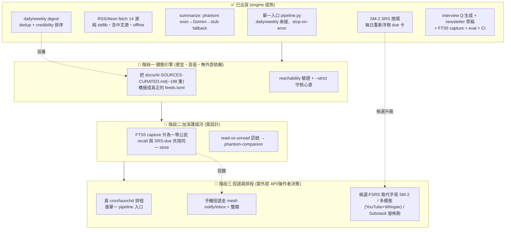

# 路線圖（繁體中文・視覺化）

> ARCHIVED 2026-06-19 — 內容已併入 docs/phantom-ai-feed.md;此為歷史版本。

> 🎯 **一行定位:** 給中文 AI/ML 工程師的「每天 10 分鐘讀完 → 週末自動出面試題複習 → 本機 RAG 可查」三合一**本機資訊代謝管線**。
>
> 🛡️ **護城河:** **owned-memory（自有記憶 FTS5）＋ SRS（間隔複習）＋ governed 個人日報（從策展來源出發）** — 不是又一個 reader。Feedly/Kagi 是雲端+英文+付費;Readwise 是 reader;**我們是中文 + 本機不外洩 + agentic + 把外部新知變成你自己可複習的記憶。**
>
> 📌 **狀態唯一真實來源(SSOT)是英文 [`ROADMAP.md`](ROADMAP.md)。** 本檔是它的視覺化中文鏡像;衝突時以英文版為準。外部選型依據見 [`docs/OSS-LANDSCAPE-AND-DIRECTION.md`](docs/OSS-LANDSCAPE-AND-DIRECTION.md)。
>
> 最後更新:**2026-06-19** · 版本 `0.2.0-alpha` · 測試 **103 passing**

---

## ① 狀態流(Mermaid)

---

## ② 分期表

> 排序原則(依單人多機開發模型):**便宜高值先 → 護城河先(owned-memory + SRS) → 需外部 API/操作者決策後。** 每階 2–4 項,grounded 於 `ROADMAP.md` Planned-next。
> 開發模型:**寫 = codex/claude;審 = codex + agy + claude(≥2 distinct-AI);governor + 雙閘 → 手機。** 分支開發、不直推 main。

### 🚧 階段一 — 餵飽引擎(高值・便宜・零外部依賴)

| 目標 | 具體項 | 在哪台機 + 哪 AI | 風險 / 前置 |
|---|---|---|---|
| 把策展目錄變成活的日報 | 解析 `docs/AI-SOURCES-CURATED.md` → 產生 `sources/feeds.toml` 條目(有原生 RSS 用之;無則 RSSHub route 或略過) | acer/ayaneo(Win)寫 Python・codex 主筆;z13 編排+把關 | 部分來源無公開 feed(WeChat/FB 封閉);**前置=逐一 re-verify URL**(策展檔已警告會漂移) |
| 不讓雜訊淹沒 | reachability 檢查 + `--strict` 只要求核心源可達 | acer・codex 寫 / agy+codex 審 | 來源變多≠變好;**靠既有 dedup + credibility 排序**,別硬加廣度 |

### 📅 階段二 — 加深護城河(owned-memory + SRS;需設計)

| 目標 | 具體項 | 在哪台機 + 哪 AI | 風險 / 前置 |
|---|---|---|---|
| owned-memory 一等公民 | digest capture 寫入 FTS5 從 best-effort 升為主路徑;recall 與 `srs due` 共用同一 store | M5/M1 Mac 或 acer・claude 寫 / codex+agy 審 | 跨平台 HOME 隔離 + EventKey flakiness(已知坑);**前置=mesh round-trip 測試綠** |
| 學習行為訊號 | read-vs-unread 比例分析 → 餵給 phantom-companion ⑦ | z13 編排・claude 設計 / codex 審 | 需 companion 端介面;**前置=companion 整合點確認** |

### 🔭 階段三 — 投遞與排程(需外部 API / 操作者決策;最後做)

| 目標 | 具體項 | 在哪台機 + 哪 AI | 風險 / 前置 |
|---|---|---|---|
| 真排程取代 hailmary cron | 把單一 `pipeline` 入口接 cron/launchd | Mac(launchd)/ Android worker・codex 寫 / claude+agy 審 | 與舊 hailmary heartbeat 遷移衝突;**前置=操作者決定遷移時點** |
| 手機投遞 + 把關 | 走 mesh phone notify/inbox + governor 雙閘(**不**新建 Telegram bot) | z13 編排 + 手機・claude / codex 審 | 重用 mesh 原語勝過新依賴;**前置=mesh notify 通道就緒** |
| 候選升級 | FSRS(MIT)替換手寫 SM-2 / 多模態(Whisper)/ Substack 發佈鉤 | acer/ayaneo・codex 寫 / agy+claude 審 | FSRS 需複習歷史才發威;發佈**必須 human-in-the-loop**;**前置=外部 API key + 操作者拍板** |

---

## ③ 刻意不做 / over-build 警戒

> 避免重造輪子;每個「候選方向」落地前須過「這真的贏過 mesh 既有原語嗎?」的閘。詳見 [`docs/OSS-LANDSCAPE-AND-DIRECTION.md`](docs/OSS-LANDSCAPE-AND-DIRECTION.md) §4。

| 🚫 不做 | 為什麼 | 既有更好者 |
|---|---|---|
| 完整 reader app / 漂亮閱讀 UI | 輸出是資料夾裡的 markdown,讓 Obsidian/任何編輯器讀即可 | Readwise Reader、FreshRSS |
| 通用 aggregator plugin 框架 | 14→~198 筆扁平 TOML 已足夠;YAGNI | Precis、RSSHub |
| 一味加來源 | 策展檔自承每日重疊(TLDR/Rundown/Neuron 同新聞);**靠 dedup+credibility** | (自身既有排序) |
| 太早換 FSRS | 需複習歷史才有增益,現換是無感 churn | 留作階段三候選 |
| 全自動 Substack 發佈 | 違反 human-in-the-loop;auth+send 維持手動 | — |
| 加依賴(Telegram/RSSHub/FSRS) | 現「純 stdlib 免安裝」是真賣點,每加一項都增表面積 | mesh notify/inbox |

---

## ④ 開發模型備忘(單人多機)

- **z13(Win):** 編排 + 對抗式把關 + 最終判斷。
- **M5 / M1(Mac):** launchd 排程、跨平台 capture 驗證。
- **acer / ayaneo(Win):** Rust/Python 撰寫節點;Win-native 驗證。
- **Android worker:** 排程/投遞執行端。
- **AI 分工:** 寫=codex/claude;審=codex + agy + claude(任意 ≥2 distinct-AI LGTM 才落地);governor + 雙閘 → 手機核准。
- **OSS 選型一律標「候選方向」**(見 landscape §3 的 adopt/wrap/reference/build/don't-build 分類),不預先綁死。

---

> 英文權威狀態請見 [`ROADMAP.md`](ROADMAP.md);外部生態與選型理由見 [`docs/OSS-LANDSCAPE-AND-DIRECTION.md`](docs/OSS-LANDSCAPE-AND-DIRECTION.md)。
