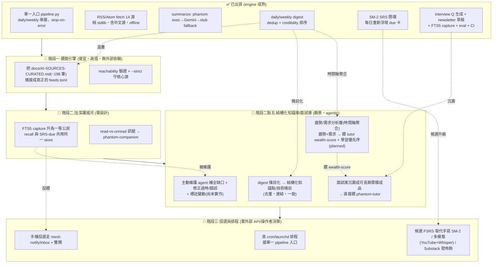

# phantom-ai-feed — 唯一主文件

> 本檔為 phantom-ai-feed 唯一主文件(繁中);英文歷史狀態與舊版鏡像見 `docs/_archive/`。
> ~198 筆的策展來源清單仍是獨立參考檔:[`docs/AI-SOURCES-CURATED.md`](AI-SOURCES-CURATED.md)。
> 對應狀態:`master` @ `c628da2` — **103 passing tests**、13 個實體模組、單一入口 `python -m phantom_ai_feed.pipeline`、純 Python 3.11+ stdlib(無 runtime 相依)。每個「已出貨」項都對應 `master` 上的真實 commit 與 `phantom_ai_feed/` 中實際存在的模組。

## 目錄
- [這是什麼](#這是什麼)
- [它怎麼運作](#它怎麼運作)
- [四個產出](#四個產出)
- [趨勢與需求分析(第四個產出)](#趨勢與需求分析第四個產出)
- [方向與願景](#方向與願景)
- [定位與護城河](#定位與護城河)
- [快速上手](#快速上手)
- [狀態與視覺路線圖](#狀態與視覺路線圖)
- [開源生態與方向](#開源生態與方向)
- [刻意不做 / over-build 風險](#刻意不做--over-build-風險)

---

## 這是什麼

**一句話:phantom-ai-feed 是一個會自己長大、自己修正的「AI 知識庫 + 面試庫」—— 等於把你手寫的「AI 學習筆記」升級成「自動學習 + 學習輔助」的版本。**

你之前是怎麼學 AI 的?多半是:讀新聞、讀論文、自己手抄一份「AI 學習筆記」(就像 [markl-a/My-AI-Learning-Notes](https://github.com/markl-a/My-AI-Learning-Notes) 那種 Jupyter 筆記)。但手寫筆記有三個老問題:**(1) 要自己天天抓料、自己整理,很累;(2) 寫完就放著,沒人提醒你複習,久了就忘;(3) 裡面的舊知識會過時、會有錯,但沒人幫你回頭修。**

phantom-ai-feed 就是要把這份「手寫 AI 學習筆記」自動化、而且加上輔助。它不是「又一個讀 AI 新聞的 app」。一般的 reader 是:你讀完 → 就忘了 → 隔天又從零開始。這個引擎相反:**它把你讀過的東西結構化沉澱成一個會長期累積的知識庫,自動把同一批知識變成面試題給你練,而且還會主動回頭幫你補缺口、修正過時或寫錯的舊知識。**

換句話說,它不是被動的 feed reader,而是一個**會主動把你的知識庫和面試庫養大、補全、修正的學習 agent**。對應 phantom-mesh 的 apex ② owned-memory「越用越懂你」—— 而且**越維護越完整、越正確**。

**為誰做的:** 中文圈的 AI/ML 工程師。你每天被上百則 AI 新聞、論文、推文淹沒,想保持領先,但時間有限、看完就忘、舊筆記又會過時。這個引擎幫你把資訊壓縮、留住、複利,還幫你維護它的正確性。

全部跑在你自己的機器上(local-first):資料落在 `~/.phantom-mesh/`,不上雲、不外洩。屬 phantom-mesh 生態系。

> **誠實提醒(別灌水):** 今天**已經會動**的是「攝取 → 消化 → SRS 複習閉環 → 本機 RAG 召回」這條引擎(103 passing tests,在 `master @ c628da2`)。而「結構化的知識庫/面試庫成品」和「會主動補全/修正的 agent」目前是**方向與願景(尚未實作的 agentic 層)**,下面每一節都會把「已出貨」和「願景」清楚分開,不會混為一談。

---

## 它怎麼運作

核心是一條會「越用越值錢」的迴圈。和舊版相比,產出不再只是「每日 digest 讀完就丟」,而是**會沉澱進一個結構化、會自我維護的知識庫/面試庫成品**:

```
攝取 → 消化 → 結構化進知識庫/面試庫 → 重浮 → 召回
(精選來源)(LLM digest)(沉澱成知識點/面試題)(SRS 間隔重複)(本機 RAG)
        ↑________ 越用越懂你 + 越維護越完整正確 ________↓
                          ▲
              agent 主動補全 / 修正(願景層)
```

每一步白話解釋:

1. **攝取(精選來源)** — 你關注的 AI 來源,每天上百則。引擎自動抓回來,先做去重(dedup)和可信度排序,不讓雜訊淹沒你。
2. **消化(LLM digest)** — 把這上百則壓成「10 分鐘能讀完」的每日 digest;週末再出一份更深的每週彙整。
3. **結構化進知識庫/面試庫** — *(願景層)* 不再是讀完就丟的一篇篇 digest,而是把攝取到的知識**沉澱成可長期累積的知識點/技術條目**,並把同一批知識**自動轉成面試題**。
4. **重浮(SRS 間隔重複)** — 自動把重點變成幾題複習(面試題形式),並用 SM-2 演算法在對的時間把「快忘掉的」重新推到你眼前。
5. **召回(本機 RAG)** — 三個月後想查「上週 RAG 最新進展是什麼?」,phantom 的 agent 能直接從你自己的記憶庫查到,還能引用出處。

**外加(願景層,關鍵):agent 不只抓最新,還會主動維護你的知識庫。** 它會自己回頭做兩件事:

- **補全** — 發現知識庫裡有缺口/斷層 → 主動補上。
  > 具體例子:agent 發現你知識庫裡某個主題只有零散片段(例如「向量資料庫」只記了一句定義,沒有脈絡)→ 主動去把上下文補齊,連成完整的一條。
- **修正** — 發現舊知識點過時或有錯 → 主動更新並標註變動。
  > 具體例子:agent 發現你知識庫裡「RAG」只記到 2024 年的做法 → 主動補上 2026 年的新法,並把舊的標成「此法已過時,已被 XXX 取代」;又或某個 API 已被官方棄用,它會標出來。

**具體例子(整條跑一遍):**
> 你關注的 30 個 AI 來源每天有上百則 → ai-feed 幫你壓成 10 分鐘能讀完的 digest → 重點結構化進你的知識庫 → 同一批自動變成面試題餵進複習(SRS)→ 三個月後你不只「讀過」,是真的記得 + 能本機 RAG 查到出處 →(願景)agent 還會在背景發現你某條舊知識過時,主動幫你修好。

**為什麼這叫「複利」(對比一般 reader 和手寫筆記):**

| | 一般 reader / 雲端 digest | 手寫 AI 學習筆記 | phantom-ai-feed |
|---|---|---|---|
| 抓料 | 要自己訂閱、自己點開 | 要自己天天找 | 引擎自動抓 + dedup + 排序 |
| 讀完之後 | 忘了,隔天從零 | 抄進筆記就放著 | 結構化進知識庫,留下來 |
| 時間久了 | 留存=0 | 越積越亂、不一致 | 知識**越積越多**且去重整併 |
| 記得住嗎 | 靠自己,通常忘光 | 沒人提醒複習 | SRS 在快忘時推回來,**越記越牢** |
| 能回頭查嗎 | 不行(或再 google) | 翻舊檔很慢 | 本機 RAG,連出處一起召回 |
| 會過時嗎 | 沒人管 | 舊筆記越放越錯 | (願景)agent **主動補全 + 修正** |
| 懂你嗎 | 不懂,千人一面 | 只是死檔案 | 越用越懂你的領域 |

差別就是:一般 reader 是「一次性消費」,讀完歸零;手寫筆記是「一次性記錄」,會過時;ai-feed 是「把每天的學習存進你的知識本金,利滾利,而且有人幫你保養」。

---

## 四個產出

phantom-ai-feed 的定位脊椎,是把同一條複利迴圈收斂成**四個明確的成品**:① 知識庫 ② 面試庫 ③ 主動維護 agent ④ 趨勢與需求分析。

### 1. AI 知識庫 *(願景層,結構化成品 — 尚未實作)*
把攝取到的知識**結構化沉澱成可長期累積的知識點/技術條目**,而不是一篇篇讀完就丟的 digest。它會去重、連結相關條目、維持一致 —— 等於一份會自己長大的個人 AI 技術 wiki。
> 今天已出貨的是底層:digest、owned-memory(FTS5)寫入、本機 RAG 召回。把這些「散落的記錄」整理成「結構化的知識點條目」這層,是願景。

### 2. 面試庫(直接餵 tutor) *(部分已出貨 + 願景升級)*
同一批知識**自動轉成面試題 / 答題要點**,並**直接餵給 phantom-tutor**(知識 → 面試題 → 練習,跨專案閉環)。你讀過、記住、複習過的「面試相關 AI 知識」,正是面試時拿得出來的彈藥。
> 今天已出貨:`interview_questions.py` 會由本週 digests 生成面試題並 `--register-srs` 種入複習卡。把它**沉澱成一個可長期累積、可直接餵 tutor 的「面試庫」成品**(而非每週一批),是願景。

### 3. 主動維護的 agent(最關鍵) *(願景層 — 尚未實作)*
除了攝取**最新**知識,agent 還會**主動**:
- **補全**:發現知識庫缺口/斷層 → 主動補上脈絡。
- **修正**:舊知識點過時或有誤 → 主動更新、標註變動。
- **整併**:去重、連結相關條目、維持一致。

這就是 phantom-ai-feed 真正的差異化:**不是被動 feed reader,而是會主動把你的知識庫 + 面試庫養大、補全、修正的學習 agent。** 這一層目前完全是願景(agentic layer,尚未實作),不是已出貨功能。

### 4. 趨勢與需求分析 *(願景層 — 尚未實作)*
把攝取到的資訊放在**時間軸**上聚合,浮出兩件事:**最近什麼在紅(趨勢)+ 什麼技能/方向正在被需要(需求)**。這不只是「今天有什麼新聞」,而是「過去這段時間,哪些主題在升溫、哪些技能在被招」。詳見下一節。
> 底層的 capture / owned-memory 已出貨;但「時間軸聚合 + 趨勢/需求情報層」是願景,尚未實作。

---

## 趨勢與需求分析(第四個產出)

> **誠實分界(先講清楚):** 底層的 capture / owned-memory(把每天攝取的資訊寫進你自己的記憶庫)**已經出貨**;但本節講的「把資訊在時間軸上聚合、浮出趨勢與需求」這個情報層,**是願景 / planned,尚未實作**。下面講的是要往哪走,不是現在跑得出來的功能。

### 是什麼

前三個產出處理的是「單一資訊」—— 這篇講什麼、變成哪題、哪裡過時。第四個產出換一個維度:**把你攝取的一大堆資訊,放在時間軸上看「整體趨勢」。**

把一段時間(例如過去 4 週)攝取到的所有資訊聚合起來,就能浮出兩件單看一篇看不出來的事:

- **趨勢** — 什麼主題在升溫?(某個題目的提及量隨時間變多 = 它正在紅)
- **需求** — 什麼技能 / 方向正在被需要?(求職市場在招什麼)

### 兩個訊號源

| 訊號源 | 浮出什麼 | 資料從哪來 |
|---|---|---|
| ① AI 內容 / 論文 / 社群 | **趨勢**:主題熱度隨時間變化(什麼在升溫) | ai-feed 自己攝取的那些精選來源 |
| ② 求職 / JD 資料 | **需求**:哪些技能正在被招、被要求 | 可接 phantom-tutor 的職缺資料 / phantom-companion 的 jobseek 追蹤 |

### 閉環(這是關鍵價值)

光知道「什麼在紅」還不夠,真正值錢的是把它變成**「我接下來該學什麼最划算」**的決策:

```
需求分析 → 哪些技能/知識正值錢 → 直接餵 phantom-tutor 的 wealth-score(職位評分)
                              └→ 排出你的學習優先序(知識庫/面試庫先補哪些主題)
```

也就是說,趨勢/需求分析把「讀資訊」升級成「決定該學什麼」:一邊餵 tutor 的 wealth-score 讓職位評分更準,一邊回頭告訴你「知識庫/面試庫先補這幾塊最划算」。

### 具體例子

> 過去 4 週,「agent / MCP」在你的來源裡的提及量翻倍(趨勢在升溫);同一時間,AI 職缺要求「LLM agent」的比例也上升(需求在變強)→ ai-feed 於是提醒你:**優先補這塊知識庫、優先練相關面試題**,因為它現在最值錢。

### 刻意不做(別把雜訊當趨勢)

- **別把單日波動 / 雜訊當趨勢。** 一兩天的尖峰不是趨勢,要看時間軸上的持續變化。
- **樣本不足就不報。** 時間窗太短、來源太少時,寧可不報,也不要亂報一個假趨勢誤導學習方向。寧缺勿亂報。

---

## 方向與願景

### 知識財富框架

phantom-mesh 生態用「三種財富」來分工:

- **tutor → 職涯財富**(幫你拿到更好的工作)
- **companion → 生活財富**(幫你過得更好)
- **ai-feed → 知識財富 / 認知資本**(幫你保持領先、把所學複利)

ai-feed 最大化的是你的**認知資本**:讓你在 AI 這個變化最快的領域**保持領先**,並把所學**複利**。而且這份知識財富會**直接餵養另外兩種**:

- 餵 **tutor** — 你讀過、記住、複習過的「面試相關 AI 知識」,正是面試時拿得出來的彈藥;這就是「面試庫」的去處。**(願景)趨勢/需求分析還會把「現在什麼技能正值錢」直接餵 tutor 的 wealth-score(職位評分),並回頭排你的學習優先序。**
- 餵 **你的日常工作** — 本機 RAG 隨時召回最新進展與出處,寫程式、做決策時直接派上用場。

### 鎖定的方向(extended)

操作者鎖定的脊椎:ai-feed = **一個會自己長大、自己修正的「AI 知識庫 + 面試庫」**,把使用者之前手寫的「AI 學習筆記」升級成「自動學習 + 學習輔助」的版本。核心轉變是:複利迴圈的產出**不再只是每日 digest,而是一個結構化、會自我維護的成品**(知識庫 / 面試庫),外加一個**會主動補全與修正的 agent**。對應 apex ② owned-memory「越用越懂你」—— 而且越維護越完整、越正確。

### 願景 vs 已出貨(誠實分開)

**已出貨(現況,grounded):** 引擎其實已經跑通了 —— 完整的 daily/weekly pipeline、SRS 閉環、FTS5 RAG capture,**103 passing tests**、13 個實體模組,都在 `master @ c628da2` 上。這不是 vaporware,是會動的引擎。今天真正能跑的是:**攝取 pipeline + SRS 複習閉環 + FTS5 RAG capture。**

**還是願景(尚未實作,標清楚):** 上面講的「結構化知識庫/面試庫成品」和「會主動補全/修正的 self-maintaining agent」**都是方向、不是已完成功能**(屬 agentic 層,尚未實作)。它們是這份文件指出的目標,不是現在 `python -m phantom_ai_feed.pipeline` 跑得出來的東西。請把它們當「規劃中」看待。

**真正的缺口(誠實面對):** 引擎成熟,但**餵食不足**。目前只抓 **14 個 feed**,而手上的策展目錄 [`docs/AI-SOURCES-CURATED.md`](AI-SOURCES-CURATED.md) 有 **~198 個來源** —— 廣度差約 **10 倍**。引擎強,但餵進去的料太少。

**#1 高值動作(願景的第一步,沒變):** 把 ~198 個策展來源接進 `sources/feeds.toml`。這是槓桿最高的單一動作 —— 純 stdlib、零新依賴,就能把廣度拉到約 10×,讓引擎真正吃飽。**先把料餵飽,後面的知識庫/面試庫/維護 agent 才有足夠的原料可長。**

**更遠的願景(尚未出貨,標清楚):** 結構化知識庫條目化、面試庫沉澱成可餵 tutor 的成品、agent 主動補全/修正舊知識、把 FTS5 capture 從 best-effort 升為一等公民、read-vs-unread 學習訊號餵給 companion、真排程(cron/launchd)、手機投遞、可選 FSRS 升級。這些在下方〈狀態與視覺路線圖〉裡分階段標明,是「願景/計畫」而非「已完成」。

---

## 定位與護城河

**phantom-ai-feed 是給中文 AI/ML 工程師的「每天 10 分鐘讀完 → 自動沉澱成知識庫/面試庫 → 週末出面試題複習 → 本機 RAG 可查」的本機資訊代謝管線,屬 phantom-mesh 生態系。** 純 Python 3.11+ 標準函式庫(`urllib`/`xml.etree`/`tomllib`)撰寫,無 runtime 相依;一次 `python -m phantom_ai_feed.pipeline` 即串接每日與每週流程。延續並重定位 [markl-a/My-AI-Learning-Notes](https://github.com/markl-a/My-AI-Learning-Notes)(19 stars,Jupyter notebook 系列)為**自動學習 + 學習輔助**的版本 —— 把手寫筆記變成 daemon-friendly、會自我維護的知識庫。

- **護城河 = owned-memory(自有記憶 FTS5)＋ SRS(SM-2 間隔複習)＋ governed 個人日報(從策展來源出發)＋(願景)主動維護的知識庫/面試庫。** 不是又一個 reader、不是又一個 aggregator。差異化在於把外部新知 → LLM digest → 寫進你自己的 owned-memory → 變成可複習的記憶 →(願景)結構化成會自我補全/修正的知識庫,而非把資料送上雲端。別人是 reader / 雲端 / 一次性;你是會記住、會重浮、會複利、會自我保養的本機引擎。
- **與競品方向相反。** Daily.dev / Feedly+AI / Kagi News 是英文圈 + 雲端 + 付費;Readwise 是 reader;Substack 週報是手寫。**phantom-ai-feed 是中文 + 本機不外洩 + agentic** — RSS 抓取走你的 phantom-mesh,摘要與面試題用可換的 LLM provider,所有資料落在 `~/.phantom-mesh/` 不外洩。
- **生態位置。** 它是 **P1 跨平台連線 + P3 進化網** 的入口層:每天把外部世界的 AI 新進展寫進你自己的 FTS5 memory,讓 phantom 的 agent 能回答「上週 RAG 最新進展是什麼?」,並供 phantom-companion ⑦ 讀作學習行為訊號;面試庫則直接餵 phantom-tutor。
- **護城河要素一句話:** local-first(本機不外洩)+ 中文工程師聚焦 + owned-memory(會記住)+ SRS 學習迴圈(會重浮、會複利)+(願景)主動補全/修正的知識庫(越維護越完整正確)。

> **招聘 / 副業視角(不塑造產品,僅為下游):** 招聘對齊中型 AI 新創(看重「能 ship 一個每天有人用的 internal tool」+ 中文社群 reach);副業可走 Substack 中文 AI 工程師週報或 Hahow 課程。**License: Apache-2.0**(© 2026 Mark Lai)。

---

## 快速上手

### Quickstart

```bash
git clone https://github.com/markl-a/phantom-ai-feed
cd phantom-ai-feed
# 無需安裝任何 runtime 套件 — 純 Python 3.11+ 標準函式庫(urllib / xml.etree / tomllib)
# 只有要跑測試時才需要:pip install pytest

# 無 API key — 用 stub summarizer 跑通
python -m phantom_ai_feed.digest --use-stub

# 有 Gemini API key
export GEMINI_API_KEY=...
python -m phantom_ai_feed.digest

# 週末面試題(讀本週的 digest)
python -m phantom_ai_feed.interview_questions --use-stub

# 單一入口:一次跑完每日(digest → 面試題 → 註冊 SRS)
python -m phantom_ai_feed.pipeline

pytest tests/ -v
```

### 寫入位置

```
~/.phantom-mesh/logs/phantom-ai-feed/YYYY-MM-DD.md
~/.phantom-mesh/logs/phantom-ai-feed/weekly-questions-YYYY-MM-DD.md
~/.phantom-mesh/logs/phantom-ai-feed/srs-due-YYYY-MM-DD.md
```

### 30 秒 demo

[`docs/demo.cast`](demo.cast) — asciinema 錄製 `phantom_ai_feed.digest --use-stub --force` 寫出當日 RSS digest。自架(self-hosted on purpose):不上傳 asciinema.org、無第三方追蹤。

```sh
asciinema play docs/demo.cast
# 或不裝任何工具直接看文字:
cat docs/demo.cast | jq -r '.[] | select(.[1]=="o") | .[2]'
```

### 資料流(在 phantom-mesh 生態內)

```
14 RSS sources (含中文來源)
   ↓ phantom_ai_feed.fetch
{title, link, summary, source}[]
   ↓ phantom_ai_feed.summarize (phantom exec → Gemini Flash → stub fallback)
Markdown digest
   ↓ phantom_ai_feed.digest
~/.phantom-mesh/logs/phantom-ai-feed/<date>.md   ←→  phantom event capture → FTS5
                                                              ↓
                                  phantom-companion ⑦ 讀作學習行為訊號
                                  phantom-mesh agent 回答可引用
                                  (願景)結構化進知識庫/面試庫 → 餵 tutor
```

> ⚠️ **同名 scaffold(勿混淆):** `~/Documents/GitHub/hailmary/phantom-ai-feed/` 是更早的 cron-only RSS heartbeat(launchd 已綁定,請勿移動)。本 repo 是它的 LLM-enabled 後繼者,最終會接手 cron。

---

## 狀態與視覺路線圖

> 排序原則(依單人多機開發模型):**便宜高值先 → 護城河先(owned-memory + SRS) → 知識庫/面試庫/維護 agent → 需外部 API/操作者決策後。**
> 每個「已出貨」項對應 `master` 上的真實 commit 與 `phantom_ai_feed/` 中實際存在的模組,無虛構。
> 開發模型:**寫 = codex/claude;審 = codex + agy + claude(任意 ≥2 distinct-AI LGTM 才落地);governor + 雙閘 → 手機核准。** 分支開發、不直推 main。
> **一句話定位本節:** 引擎已成熟(✅),最大缺口是「餵食不足」—— 故 **#1 move = 策展目錄 → `feeds.toml`**;而「結構化知識庫/面試庫成品」與「主動補全/修正 agent」都在規劃階段(願景,未出貨)。

### 狀態流(Mermaid)



### ✅ 已出貨(grounded,對應真實模組)

整條每日/每週 pipeline 已從單一入口端到端運行。版本 `0.2.0-alpha`、測試 **103 passing**、13 個實體模組。

| 項目 | 具體內容 | 對應模組 |
|---|---|---|
| 單一入口 orchestrator | `python -m phantom_ai_feed.pipeline` 串接(每日:digest → interview-questions `--register-srs`;每週加 weekly → newsletter),stop-on-first-error。實現「daemon-friendly 單一排程呼叫」 | `pipeline.py` |
| RSS/Atom 抓取 | 14 feeds(含中文 `zh` 源 + `optional`-flag 廣度源)、上限 retry/backoff、保留 inline-tag 後文字的 HTML 去標籤、per-feed 狀態計數、`PHANTOM_AI_FEED_OFFLINE=1` | `fetch.py` |
| 摘要 | `phantom exec` → Gemini Flash REST → stdlib 抽取式 stub fallback(degrade-don't-crash,免金鑰) | `summarize.py` |
| 每日 digest | fetch → summarize → 寫 Markdown + best-effort phantom capture;浮現 dedup + credibility「Top picks」 | `digest.py` |
| 每週 digest | fetch wide → 跨來源 dedup/分群 → credibility 排序 → 單次 LLM pass;浮現 credibility + corroboration | `weekly.py` |
| 跨來源 dedup / 分群 | URL + title-overlap 合併(空標題 + 不同 URL 不再 false-merge) | `dedup.py` |
| 來源可信度加權 | per-category trust + fetch history + corroboration(distinct sources 非 raw dups)供排序與 dedup tie-break | `credibility.py` |
| 面試題產生器 | 週末由本週 digests 生成;`--register-srs` 種入複習卡(= 面試庫的雛形,尚未沉澱成長期成品) | `interview_questions.py` |
| SM-2 間隔複習 | `srs answer` / `srs due` CLI;每日 pipeline 現會**重新浮現 due 卡**(`srs-due-<date>.md`),閉合 SRS 迴圈(非 write-only) | `srs.py` |
| newsletter 草稿 | 由每週 digest + 面試題組出 Substack-style 草稿;無內部 provenance 洩入 reader 草稿(human-in-the-loop,never autopilot) | `newsletter.py` |
| FTS5 capture adapter | 把 entry fold 進 phantom store(unit-tested CLI seam)= 知識庫的底層儲存 | `capture.py` |
| Eval harness | 對真實 ~20-Q gold set 評分(coverage / category-mix / dup metrics + 校準 pass/fail) | `eval.py` |
| `--strict` run | optional `feed` flag 受理,strict run 只要求核心 feed 集可達 | (CLI flag) |
| Mesh round-trip test | gated LIVE `capture_entry → phantom serve → recall` 整合測試(Windows/no-provider skip;HOME-isolated;hermetic) | (integration test) |
| CI | GitHub Actions pytest workflow + badge;asciinema demo cast | `docs/demo.cast` |

### 🚧 階段一 — 餵飽引擎(高值・便宜・零外部依賴)

> 這是 **#1 高值動作**:引擎已成熟但餵食不足(只抓 14 feed,策展目錄有 ~198,廣度約 10× 落差)。把料餵飽,引擎立刻發揮全力,知識庫/面試庫也才有足夠原料可長。

| 目標 | 具體項 | 在哪台機 + 哪 AI | 風險 / 前置 |
|---|---|---|---|
| 把策展目錄變成活的日報 | 解析 [`docs/AI-SOURCES-CURATED.md`](AI-SOURCES-CURATED.md)(~198 筆) → 產生 `sources/feeds.toml` 條目(有原生 RSS 用之;無則 RSSHub route 或略過) | Win 節點寫 Python・codex 主筆;編排節點(Win)編排+把關 | 部分來源無公開 feed(WeChat/FB 封閉);**前置=逐一 re-verify URL**(策展檔已警告會漂移) |
| 不讓雜訊淹沒 | reachability 檢查 + `--strict` 只要求核心源可達 | Win 節點・codex 寫 / agy+codex 審 | 來源變多≠變好;**靠既有 dedup + credibility 排序**,別硬加廣度 |

### 📅 階段二 — 加深護城河(owned-memory + SRS;需設計)

| 目標 | 具體項 | 在哪台機 + 哪 AI | 風險 / 前置 |
|---|---|---|---|
| owned-memory 一等公民 | digest capture 寫入 FTS5 從 best-effort 升為主路徑;recall 與 `srs due` 共用同一 store | Mac 節點 或 Win 節點・claude 寫 / codex+agy 審 | 跨平台 HOME 隔離 + EventKey flakiness(已知坑);**前置=mesh round-trip 測試綠** |
| 學習行為訊號 | read-vs-unread 比例分析 → 餵給 phantom-companion ⑦ | 編排節點(Win)編排・claude 設計 / codex 審 | 需 companion 端介面;**前置=companion 整合點確認** |

### 🧱 階段二點五 — 結構化知識庫 / 面試庫 + 主動維護 agent(願景・agentic,尚未實作)

> 這是操作者鎖定的新方向所在,但**整層都是規劃中、尚未實作**;它建在「階段二 owned-memory 一等公民」之上。別把它當已出貨。

| 目標 | 具體項 | 在哪台機 + 哪 AI | 風險 / 前置 |
|---|---|---|---|
| 結構化 AI 知識庫 | 把 digest/capture 從「散落記錄」升為**結構化知識點/技術條目**(去重、連結相關條目、維持一致)= 會自己長大的個人 AI wiki | 編排節點(Win)編排・claude 設計 / codex+agy 審 | 需先有一等公民 FTS5 store;**前置=階段二完成 + schema 設計** |
| 面試庫(餵 tutor) | 把每週面試題沉澱成**可長期累積、可直接餵 phantom-tutor** 的面試庫成品(知識 → 面試題 → 練習閉環) | Win 節點・codex 寫 / claude+agy 審 | 需 tutor 端介面;**前置=tutor 整合點確認** |
| 主動維護 agent | agent 主動**補全**缺口(片段 → 補脈絡)、**修正**過時/錯誤舊知識(標「已過時/已被取代」)、整併去重 | 編排節點(Win)編排・claude 設計 / codex+agy 審 | 需 agent 框架 + 可信度驗證避免亂改;**前置=知識庫 schema + governor 把關(改寫須可審) ** |
| 趨勢 / 需求分析層(規劃 / 願景) | 把攝取資訊在**時間軸**上聚合 → 浮趨勢(主題熱度變化)+ 需求(JD 在招什麼)→ **餵 phantom-tutor wealth-score + 排學習優先序**(知識庫/面試庫先補哪些) | 編排節點(Win)編排・claude 設計 / codex+agy 審 | 需足夠時間窗 + 來源量(樣本不足不報);**前置=餵料充足 + tutor/companion 職缺資料介面** |

### 🔭 階段三 — 投遞與排程(需外部 API / 操作者決策;最後做)

| 目標 | 具體項 | 在哪台機 + 哪 AI | 風險 / 前置 |
|---|---|---|---|
| 真排程取代 hailmary cron | 把單一 `pipeline` 入口接 cron/launchd | Mac(launchd)/ Android worker・codex 寫 / claude+agy 審 | 與舊 hailmary heartbeat 遷移衝突;**前置=操作者決定遷移時點** |
| 手機投遞 + 把關 | 走 mesh phone notify/inbox + governor 雙閘(**不**新建 Telegram bot) | 編排節點(Win)編排 + 手機・claude / codex 審 | 重用 mesh 原語勝過新依賴;**前置=mesh notify 通道就緒** |
| 候選升級 | FSRS(MIT)替換手寫 SM-2 / 多模態(Whisper)/ Substack 發佈鉤 | Win 節點・codex 寫 / agy+claude 審 | FSRS 需複習歷史才發威;發佈**必須 human-in-the-loop**;**前置=外部 API key + 操作者拍板** |

> 圖例:✅ 已出貨 ｜ 🚧 近期/計畫(目前無項目實際在 flight) ｜ 📅 之後 ｜ 🧱 願景結構層 ｜ 🔭 願景 ｜ 🔴 高風險 ｜ ⚠️ over-build 警戒

---

## 開源生態與方向

> 快照 2026-06-19。star 數／授權在標註處皆經 web fetch 驗證;預期會 drift —— **採用任何相依前請重新驗證**,無法直接確認者標 `[unverified]`。本節為決策輔助,非規格書 —— 專案狀態以上方〈狀態與視覺路線圖〉為準。
> **攝取來源清單(策展種子,~198 筆 newsletters/blogs/YouTube/X/papers/CN/JP/zh/aggregators)獨立保存於 [`docs/AI-SOURCES-CURATED.md`](AI-SOURCES-CURATED.md)** —— 它是 pipeline 的種子內容(複利迴圈第一步「攝取」的來源池),槓桿最高但尚未動用的資產(目前只抓 14-feed,策展目錄廣度約 10×)。本檔只**連結**它、不把那 198 筆折進來(它是資料/種子,不是文件版本)。

**一句話論點:別造 reader、別造 aggregator framework、也別造 flashcard app —— 那些都已存在且十分優秀。要造的是那條薄的、受治理的、local-first 迴圈,把策展 AI 來源清單 → LLM digest → owned-memory → SRS →(願景)結構化知識庫/面試庫 + 主動維護 agent 串起來,這是沒有人為自己機器上的 zh-language 工程師所做的事。**

### 2.1 AI 新聞聚合器／digest(最接近的「競爭者」)

| 專案 | URL | 授權 | 對我們利基的契合／落差 |
|---|---|---|---|
| **AI News**(smol.ai / swyx) | news.smol.ai | proprietary-ish `[unverified]` | **參考,別 clone。** 自動聚合 Discord/Twitter/Reddit + LLM 成每日一期 —— 正是我們的輸出形狀,但屬雲端、英文、無 SRS、無 owned-memory、無自我維護知識庫。digest 品質最佳範本。 |
| **Feedly AI** | feedly.com | commercial SaaS | **anti-pattern。** 純雲端、訂閱制、資料離開你的機器。印證市場(LLM 摘要已是 table-stakes)與我們切入的缺口(無 local-first / 無 zh-engineer 聚焦 / 無 SRS / 無主動修正)。 |
| **Kagi News** | kagi.com | commercial | **參考。** RSS → LLM context → 摘要成文章,與我們 digest 核心迴圈相同。雲端、付費、面向一般受眾。印證「RSS→LLM digest」是真實品類。 |
| AI-News-Aggregator(AKAlSS) | github.com/AKAlSS/AI-News-Aggregator | `[unverified]` | RSS→每日 digest→Notion。骨架相同但綁 Notion、無 SRS、無本地儲存。無可採用之處;印證此模式很常見(故護城河必須是學習迴圈 + 自我維護知識庫)。 |

### 2.2 RSS readers + LLM summarizers(可能 wrap/reference)

| 專案 | URL | 星數 | 授權 | 契合／落差 |
|---|---|---|---|---|
| **FreshRSS** | github.com/FreshRSS/FreshRSS | 15.3k | AGPL-3.0 | 自架聚合器主流,有「Feed Digest」LLM 擴充。**太重,無法嵌入**(PHP 多使用者 web app)。作 OPML/來源管理參考與人類 fallback reader 出色。 |
| **Precis**(leozqin) | github.com/leozqin/precis | 94 | MIT | **架構上最近的近親**:Python、LLM 摘要、notification-first。我們已自備 fetch+summarize,**參考其 notification/handler 外掛設計**即可,別相依。 |
| **RLLM**(DanielZhangyc) | github.com/DanielZhangyc/RLLM | 96 | MIT | iOS LLM-driven RSS reader。平台不對(Swift),但日後若有 phantom-mobile reader 可作 **UX 參考**。 |
| **FeedSummarizer** / **rss-llm** | github.com/GuizzyQC/FeedSummarizer · github.com/apiad/rss-llm | small `[unverified]` | `[unverified]` | CLI:RSS→LLM 摘要。我們已做得更好(可切換 provider + stub fallback)。**不採用**;印證模式普遍。 |
| **RSS-to-Telegram-Bot** | github.com/Rongronggg9/RSS-to-Telegram-Bot | mid `[unverified]` | `[unverified]` | **遞送參考。** 若要 push 遞送這是經驗證模式 —— 但 mesh 已具 phone notify/inbox,**優先用 mesh channel**,別加 bot 相依。 |
| **RSSHub** | github.com/DIYgod/RSSHub | very high `[unverified]` | MIT `[unverified]` | 把～任何東西轉成 RSS。**參考／可選上游**:策展來源無原生 feed 時可合成。別自己 host,當 feed-less 來源的逃生口引用。 |

### 2.3 知識 feed／PKM(「不要重造」區)

| 專案 | 模型 | 授權 | 契合／落差 |
|---|---|---|---|
| **Readwise Reader** | proprietary SaaS | commercial | read-it-later + highlights + **SRS 重新浮現**的黃金標準。**這正是 over-build 陷阱:絕不要重造一個 reader。** 他們的 SRS-over-highlights 概念上就是我們 SRS-over-questions;差異化在 local-first + zh + 受治理 pipeline + 自我維護知識庫,而非 reader app。 |
| **Obsidian + Readwise plugin** | plugin `[unverified]` | MIT-ish | PKM 落地點。我們 digest 是 `~/.phantom-mesh/logs/...` 的 markdown —— **Obsidian 已可索引該資料夾**。整合 = 指向輸出目錄,而非開發。僅供參考。 |

### 2.4 間隔重複引擎(驗證我們的 SM-2;候選升級)

| 專案 | URL | 授權 | 契合／落差 |
|---|---|---|---|
| **FSRS** / fsrs4anki | github.com/open-spaced-repetition/fsrs4anki | MIT | 現代 ML 排程器;等同記憶留存下 **比 SM-2 少 20–30% 複習量**(500M+ Anki review 基準),現為 Anki 預設。**替換手寫 SM-2 的強力候選**。**稍後採用**:SM-2 在 alpha 已足夠,FSRS 需複習歷史才展優勢。 |
| **free-spaced-repetition-scheduler** | github.com/open-spaced-repetition/free-spaced-repetition-scheduler | MIT | FSRS 乾淨函式庫形式 —— 升級 `srs.py` 時實際會引入的相依。與我們 Apache-2.0 相容。 |
| **Anki** | apps.ankiweb.net | AGPL-3.0 | 既有霸主。**不要重造。** 我們的 SRS 針對 digest 衍生問題(面試庫),非通用 flashcard app —— 利基不同。僅供演算法正確性參考。 |

### 建議方向(adopt / wrap / reference / build / don't-build)

| 決策 | 內容 | 原因 |
|---|---|---|
| **BUILD(便宜、高值)** | 把 [`docs/AI-SOURCES-CURATED.md`](AI-SOURCES-CURATED.md) → 真實 feed 接起來(解析成 `sources/feeds.toml`;有原生 RSS 就用,沒有走 RSSHub route 或略過) | 槓桿最高的單一動作。引擎已存在,只是餵食不足。靜態文件 → 廣度約 10× 的活躍 digest。純 stdlib + 一個 parser。 |
| **BUILD(護城河)** | 深化 owned-memory + SRS:digest capture 寫入 FTS5 升為一等公民,recall 與 SRS-due 讀同一 store | apex-② owned-memory 的差異化,真正的利基。無競爭者在本地把個人 digest 與 owned-memory + SRS 配對。 |
| **BUILD(願景・agentic)** | 結構化知識庫/面試庫 + 主動補全/修正 agent(把散落記錄升為條目化知識點;面試庫餵 tutor;agent 補缺口、修過時) | 真正的脊椎差異化:沒有人為 zh 工程師做「會自己長大 + 自己修正」的本機知識庫。**但屬願景,需先完成餵料 + owned-memory 一等公民,且改寫須過 governor。** |
| **WRAP / REUSE** | phantom-mesh 遞送 + 治理:digest 遞送與「publish」用 mesh phone notify/inbox + governor double-gate,而非新增 Telegram bot | 上游已建好;reuse 勝過 rebuild。publish 維持 human-in-the-loop。 |
| **REFERENCE(別相依)** | smol.ai AI News(digest 品質)、Precis(handler/notification 設計)、Kagi News(RSS→LLM 觀念)、RSSHub(feed-less 逃生口) | 偷形狀,別偷程式碼。讓相依表面趨近於零(當前賣點:純 stdlib)。 |
| **ADOPT LATER** | FSRS(`free-spaced-repetition-scheduler`,MIT)替換手寫 SM-2 | 真實效率提升,但只在累積複習歷史後才有意義;現在太早。候選,非承諾。 |
| **DON'T BUILD** | reader app(Readwise)、flashcard app(Anki)、多使用者 web 聚合器(FreshRSS)、hosted SaaS(Feedly/Kagi) | 全都已存在、資源更充足。重造任一即 over-build,並放棄 local-first/單人聚焦。 |

**分階段路徑(依 ROADMAP「Planned-next」):** Phase 1 餵食引擎(策展目錄 → `feeds.toml`,驗可達,`--strict` 守核心) → Phase 2 深化護城河(一等公民 FTS5 capture + 統一 recall/SRS store + companion read-vs-unread 訊號) → Phase 2.5 結構化知識庫/面試庫 + 主動補全/修正 agent(願景・agentic,改寫須過 governor) → Phase 3 遞送 + 排程(真 cron/launchd、mesh phone 遞送、可選 FSRS、可選 multimodal/Substack hook,全部 human-in-the-loop 且在 governor 之後)。

---

## 刻意不做 / over-build 風險

> 每個「候選方向」落地前須過「這真的贏過 mesh 既有原語嗎?」的閘。各 `[unverified]` 標記在寫入程式碼/相依前皆應對照活躍倉庫確認。

| 🚫 不做 | 為什麼 | 既有更好者 |
|---|---|---|
| 完整 reader app / 漂亮閱讀 UI | 輸出是資料夾裡的 markdown,讓 Obsidian/任何編輯器讀即可。Readwise/FreshRSS 在這場仗會贏 | Readwise Reader、FreshRSS |
| 通用 aggregator plugin 框架 | 14→~198 筆扁平 TOML 已足夠;別把 `fetch.py` 一般化成外掛框架(YAGNI) | Precis、RSSHub |
| 一味加來源 | 策展檔自承每日重疊(TLDR/Rundown/Neuron 同新聞);**靠 dedup + credibility 排序**,加原始廣度只加雜訊 | (自身既有排序) |
| 讓維護 agent 亂改知識庫 | 「主動修正舊知識」很強,但若沒把關會把對的改錯;改寫**必須可審 + 標註變動 + 過 governor**,不可全自動覆寫 | (governor 雙閘) |
| 把雜訊 / 單日波動當趨勢 | 趨勢/需求分析很誘人,但一兩天的尖峰不是趨勢;**樣本不足(時間窗太短 / 來源太少)就不報**,寧缺勿亂報,別用假趨勢誤導學習方向 | (時間軸聚合 + 足夠樣本門檻) |
| 太早做知識庫/面試庫結構層 | 在餵料不足 + owned-memory 還沒升一等公民前先做 schema,等於蓋在沙上;**先餵飽 + 穩底層** | (留作階段二點五) |
| 太早換 FSRS | 需複習歷史才有增益;在沒資料可擬合前替換能運作的 SM-2,只有 churn 無使用者可見收益 | 留作階段三候選 |
| 全自動 Substack 發佈 | 違反 human-in-the-loop;auth + send 維持手動 | — |
| 加依賴(Telegram/RSSHub/FSRS) | 現「純 stdlib 免安裝」是真賣點,每加一項都增表面積;每項落地前須過 mesh-primitive 門檻 | mesh notify/inbox |

**最大風險 = 範圍蔓延成通用 reader / aggregator / flashcard 框架。** 那些都已存在且資源更充足;重造任一即放棄 local-first + 單人 + zh 聚焦的真正利基。護城河(owned-memory + SRS + governed digest)在*架構上*已存在,但只被*部分*發揮 —— 把策展目錄接成活 feed、把 FTS5 capture 升為一等公民,就是兌現它(讓複利迴圈真正轉起來);再往上,把它結構化成會自我補全/修正的知識庫 + 面試庫(願景),才是把「你的手寫 AI 學習筆記」真正升級成「會自己長大 + 自己修正」的版本 —— 而非另起爐灶。

---

> 英文權威狀態(SSOT)的歷史版見 [`docs/_archive/ROADMAP.md`](_archive/ROADMAP.md);其餘併入本檔的歷史文件見 [`docs/_archive/`](_archive/)。產品 spec(設計意圖)見 [`docs/03-phantom-ai-feed.md`](03-phantom-ai-feed.md)。
